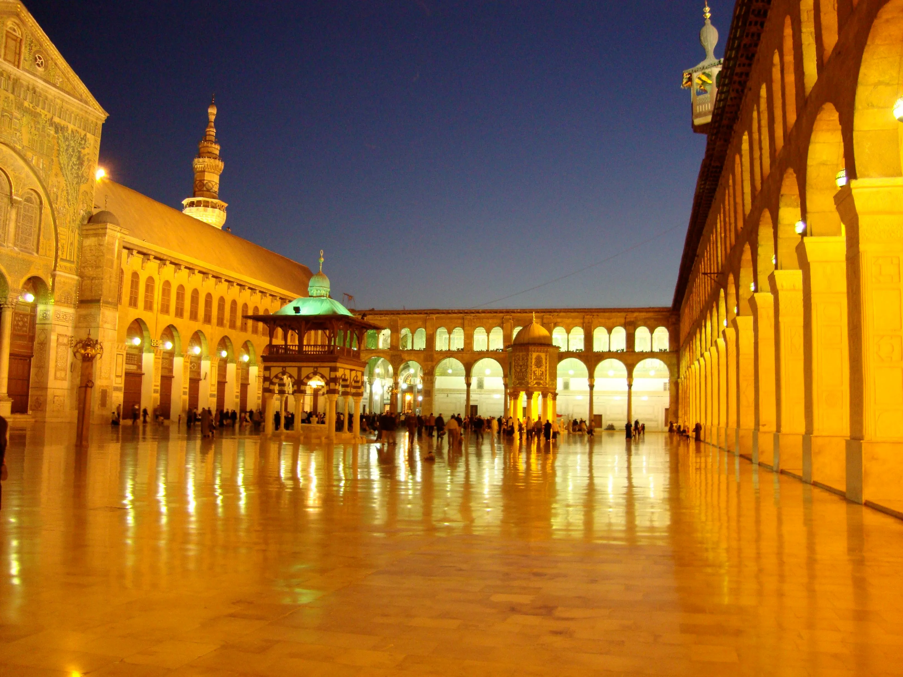
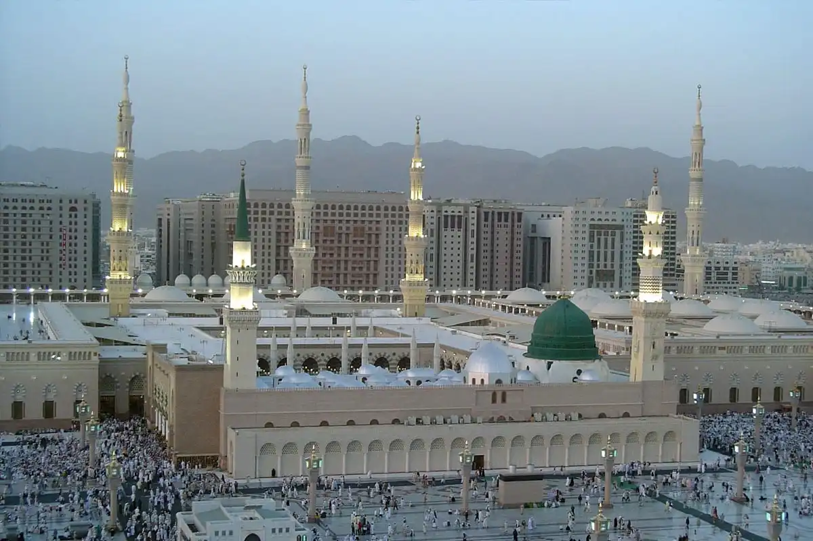

<!-- vim-markdown-toc GFM -->

* [Islamic Art](#islamic-art)
	* [Mosques](#mosques)
	* [Great examples of islamic art](#great-examples-of-islamic-art)
		* [Great Mosque of Damascus](#great-mosque-of-damascus)
		* [Al-Masjid an-Nabawi of Medina](#al-masjid-an-nabawi-of-medina)

<!-- vim-markdown-toc -->

# Islamic Art

## Mosques

The very first mosques in the Arabic Peninsula were a simple, quadrat, 
construction with a small courtyard in front of it. There were still no 
_minbar_, _mirhab_ nor any idea of a minaret.

Those would be introduced by the Ommayads, with the early minarets being 
inspired by the late Roman defensive towers.

## Great examples of islamic art

### Great Mosque of Damascus

### Al-Masjid an-Nabawi of Medina

