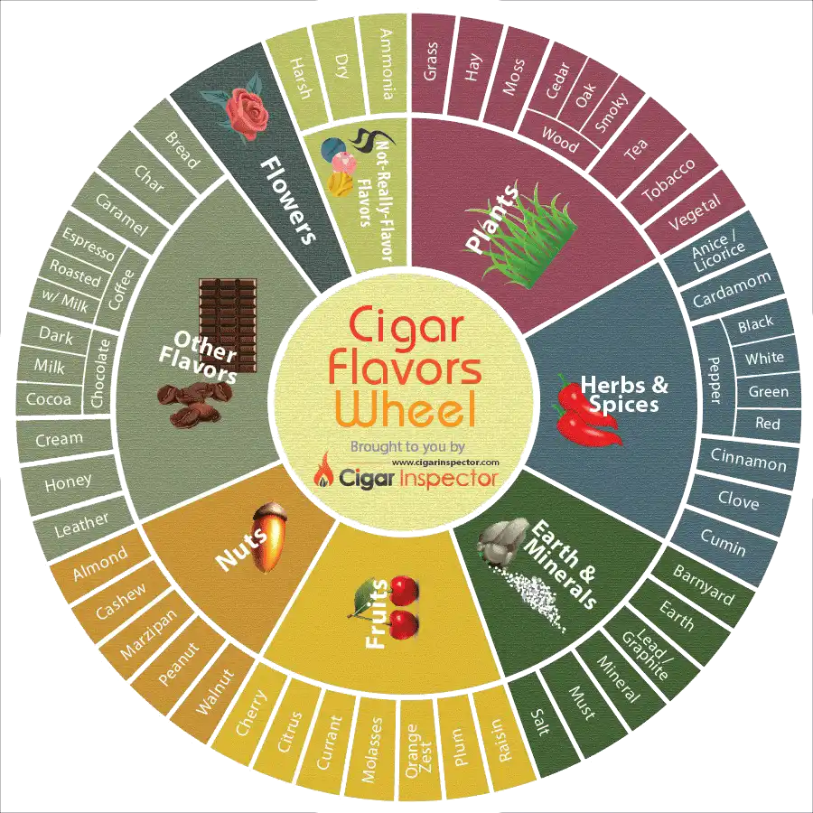

<!-- vim-markdown-toc GFM -->

* [Cigars flavours](#cigars-flavours)
	* [Plants](#plants)
	* [Spices and Herbs](#spices-and-herbs)
	* [Earth and Minerals](#earth-and-minerals)
	* [Fruits](#fruits)
	* [Nuts](#nuts)
	* [Flowers](#flowers)
	* [Other](#other)
	* [Not-Really-Flavor Flavors](#not-really-flavor-flavors)
* [Brands](#brands)

<!-- vim-markdown-toc -->

I am not an heavy smoker by any statistics. I dislike cigarettes and vaping, never got into weed even. But cigars, I like them. Very rarely I smoke one, more often the small ones, cigarillos, rather than the chunky ones. One every 2-3 weeks, at most.

I am not a huge fan nor a conneisseur. But love to identify the different flavours in a cigar.

## Cigars flavours

Credit to [Cigar Inspector](https://www.cigarinspector.com/cigars-101/cigar-flavor-components).

### Plants

This component does not have as many colorful descriptors as some of the other core components, but every cigar has at least one flavor from this section.

* Grass – often found in milder cigars, most notably those that are Connecticut Shade wrapped. Candela cigars because of the retained chlorophyll also often carry this flavor.
* Hay – very similar to grass but with that extra barnyard component.
* Moss – a lot of mild cigars, generally from the DR and Honduras, can exhibit this flavor. It’s a cross between earth and grass with a bit of must. Puros Indios cigars have this flavor component.
* Tea – one of those elusive flavors. Reportedly present in heavily aged cigars.
* Tobacco – no stretch here that tobacco tastes like… tobacco. Usually this is used to describe a cigar that has a strong “tobacco core”. Cuban Partagas comes to mind.
* Wood – this is a big component in tasting cigars. To me most cigars have some sort of woody component to it. This is most easily detected in milder cigars that are wrapped in Connecticut Shade leaves.
    * Cedar – a lot of cigars are cedar-aged (in humidors or en cedro) or boxed in cedar cabinets, so this is often a flavor that is imparted on the cigar after the leaves have been fermented and aged in the barns.
    * Oak – some specialty cigars are oak cask-aged and some have this flavor naturally. It’s reminiscent of tannic qualities in wines, and is often accompanied with a dryness on the palate. Try the Aurora Barrel-Aged cigars for this flavor prominently on display.
    * Smoky – when used it is referring to the flavor of smoked wood like hickory or mesquite.

* Vegetal – a general descriptor for a “green” plant-like flavor.

### Spices and Herbs

This section will be a little broad in what is considered a spice or herb, but I see it as a good area to describe kitchen/baking flavors.

* Anise – see licorice.
* Cardamom
* Cinnamon – mostly the “hot” cinnamon variety, a similar feeling to eating a Red Hot candy. Cigars loaded with ligero can express this flavor.
* Clove
* Cumin – kind of smoky and woody (some say musky).
* Licorice – great flavor found once the sweet spot of the cigar is reached, often detected on the finish.
* Pepper – can be found in a lot of Corojo wrapped cigars (Camacho, Don Pepin, Tatuaje, etc.) as well as the heavy ligero cigars like the Joya de Nicaragua Antano and the La Flor Dominicana Ligero and Double Ligero. Look for further embellishment like white, red and black pepper.
* Spicy – this is kind of a weird one. It’s used liberally to describe a cigar that has full flavor, or is very strong, a peppery cigar or a cigar with a lot of the “kitchen” spices (cloves, cinnamon…). I tend not to use this as it can mean different things to different people.

### Earth and Minerals

These flavor components have an elemental feel to them and are probably more a reflection of the country, region, soil composition and the fertilizers used in growing the tobacco plants.

* Barnyard – a combination of several flavors: grass, hay and earth often with some mustiness thrown in.
* Earth – a cigar that is described as earthy can have a few flavor components to it like soil (dirt), must, and even some deep vegetal flavors like moss and loam. I find this component most in Nicaraguan cigars.
* Lead – tastes like, well, lead. Embellished as pencil lead or graphite.
* Mineral – a general “mineraly-ness”, mostly lead.
* Must – this is a tough one. It’s kind of earthy and dusty but also has an aged feel to it. The best example is Cuban cigars. Cuban cigars = must.
* Salt – hopefully this isn’t the actual transfer of sweaty armpits carrying the bales of tobacco to our mouth… but this can be found in some cigars most notably Cubans, especially Punch.

### Fruits

Unlike wine tasting, fruit flavors are not as prominent.

* Cherry – I’ve heard this described occasionally and have only tasted it in a few cigars, and mostly in the finish. It’s usually a very subtle flavor to detect. Try La Flor Dominicana cigars, especially the Double Ligero line to pick up cherry.
* Citrus – usually a way to describe a cigar that has a certain “bite” to it. It can be both from improper fermentation and also from the tobacco itself. Most Don Pepin Garcia cigars have an acidic (or citrus) flavor component to them.
* Molasses – a very sweet flavor.
* Orange zest – quite a recognizable flavor
* Raisin – can’t say I really have ever picked up raisin notes, but many have.

### Nuts

A prominent flavor in lots of cigars. A surprisingly wide variety of nuts can be detected in cigars. “Roasted” can often be thrown in front of these flavors to add a smoky element to them.

* Almond – a great flavor found often on the finish.
* Cashew – this one is a bit of a stretch for me but I’ve seen it before in Cigar Aficionado…
* Marzipan – a sweet almond flavor.
* Peanut – every now and then I can get a peanut note in milder Connecticut Shade cigars. Peanut butter is also used descriptively.
* Pistachio – another CA fave.
* Walnut – a nuttiness that’s a little dry on the palate.

### Flowers

In my opinion this is where wine and cigars diverge. Some cigars have a general “perfuminess”, but no flower flavors here. Maybe rose in the aroma if you’re stretching it. Others believe there are many cigars that have floral qualities, so it is included.

* Floral – a general “perfuminess”.

### Other

This is a pretty broad category that will be used to describe a lot of other flavors or sensations that really don’t fall into the other categories.

* Bread – an often disliked flavor. Can be further embellished as toast or dough.
* Char – a combination of flavors: meaty and smoky.
* Caramel – creamy caramelized sugar! Some Cameroons and H2000 wrappers can exhibit this flavor.
* Chocolate – this is a flavor I pick up more in the finish than in the initial inhale/exhale and is found often in Connecticut Broadleaf wrapped cigars. This can be further detailed as dark or milk chocolate and cocoa.
* Coffee – great flavor most often found in the finish and sweet spots. Can be embellished further as mild coffee, espresso, roasted coffee beans, café au lait (coffee w/ a creaminess), etc.
* Cream – not really the flavor of milk, but the general description of the type of flavors. Most creamy cigars are mild and most are of the Connecticut Shade variety.
* Honey – not sure where to put this, so it goes here. Described often in aged cigars.
* Leather – one of my favorite cigar flavor components. Leather “taste” really shows up in the exhale and finish and is tasted mostly through the nose. For some reason the Rosado shade yields the most leather flavor, so look for this in Opus X and Partagas Spanish Rosados.
* Meaty – the flavor of grilled hamburger comes to mind. A lot of rich maduros, especially from Nicaragua, can have this flavor.
* Mocha – a combination of chocolate and coffee flavors. This shows up often in the last third of a cigar once you reach the “sweet spot”.
* Musk – also known as the “animal” flavor.
* Sweet – there’s artificial sweet (sweet-tipped) and then there’s natural sweet. The natural sweetness is used to describe a cigar that has a general sugary flavor whether it be something like caramel, cocoa or marzipan. Many maduros are often described as sweet.

### Not-Really-Flavor Flavors

This is a pretty broad category that will be used to describe a lot of other flavors or sensations that really don’t fall into the other categories.

* Acidic – see “Citrus” in the fruit section.
* Ammonia – not really a flavor, it’s actually what you are tasting – ammonia. Ammonia is a by-product of tobacco fermentation and improper fermentation and aging will result in a lot of ammonia left in the cigar. A huge turn-off for cigar lovers.
* Chewy – again, not really a flavor, more of an experience. A cigar where the smoke has an apparent texture to it in your mouth would be considered “chewy”.
* Dry – just like wines and tea, a cigar that has that tannic quality that dries out your mouth and teeth. Found mostly in Connecticut Shade cigars – think Davidoff. Cigar Aficionado hates this, but I’m a big fan.
* Harsh – not really a flavor per se, but definitely used to describe a cigar that may have one or several of the following components: ammonia, pepper and spice. Usually used to describe a cigar that is too young or unbalanced/muddled.

## Brands

A probably complete [list of Cuban cigar brands](https://www.cubancigarwebsite.com/brands).
