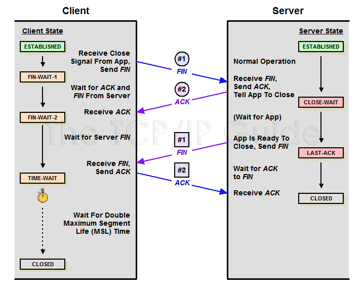

<!-- vim-markdown-toc GFM -->

	* [HTTP Status Codes](#http-status-codes)
	* [OSI Model](#osi-model)
	* [TCP connection states](#tcp-connection-states)
* [Firewalls](#firewalls)
* [VLANs](#vlans)
* [DNS](#dns)
	* [Basic concepts](#basic-concepts)
	* [Resource Records](#resource-records)
	* [DNS Query](#dns-query)
	* [DNS Fields](#dns-fields)
* [VPN](#vpn)
* [IP Addressing](#ip-addressing)

<!-- vim-markdown-toc -->

-----------------

### HTTP Status Codes


### OSI Model


### TCP connection states

+ **CLOSED**: No connection
+ **LISTEN**: The local end-point is waiting for a connection request from a remote end-point
+ **ESTABLISHED**: The third step of the 3-way connection handshake was performed. The connection is open
+ **FIN-WAIT-1**: The first step of a 4-way active clsoe was performed. Local end-point has sent a connection termination request to the remote end-point
+ **CLOSE-WAIT**: The local end-point has received a connection termination request and acknowledged it
+ **FIN-WAIT-2**: The remote end-point has sent an acknowledgement for the previously sent connection termination request. The local end-point waits for an active connection termination request from the remote end-point
+ **LAST-ACK**: The local end-point has performed a passive close and initiated an active close by sending a connection termination request to the remote end-point
+ **CLOSING**: The local end-point is waiting for an acknowledgement for a connection termination request before going to the `TIME-WAIT` state
+ **TIME-WAIT**: The local end-point waits for twice the maximum segment lifetime (MSL) to pass before going to `CLOSED` state



## Firewalls

+ **Stateless Firewalls**: also known as **packet filters**, operate on a port/protocol level
+ **Stateful Firewalls**: can group packets and can filter based on the state of them (__RELATED__, __ESTABLISHED__ and so on)
+ **Application Layer Firewalls**: operate at OSI Layer 7, can identify packet based on the application generating it, and filter according to per application rules

## VLANs

A virtual local area network is a logical subnetwork that groups different physical devices from various physical LANs.

**Static VLANs** are physically attached to specific ports of a switch. They are also called then _port-based VLANs_. Any device attached to these ports will join the VLAN.

**Dynamic VLANs** instead are defined by physical addresses (MACs) of the devices or network account names and are not physically based.

VLANs follow the IEEE 802.1Q standard that consists of 32bits added to the standard Ethernet frame header.

## DNS

### Basic concepts

+ **Autoritative NS**: a server that has the domain's data. If the server is not authoritative of the requested domain, it will point to another NS or serve cached copies of other NS
+ **Zone file**: text file containing the mapping between domain names and IP addresses
+ **Root Servers**: 13 main IP addresses of DNS servers, a to h, routed to the nearest mirror of the server
+ **Domain Level NS**: the actual servers containing the records for the requested domains (think of ns1.domain.com, ns2.domain.com etc.)

### Resource Records

+ **A Record**: map a host to an IP address. Example: `host IN A 222.64.51.99`
+ **MX Record**: map a mail exchange used for the domain. Example: `IN MX 10 mail.domain.com.`, where 10 is the priority
+ **PTR Record**: used for Reverse DNS lookups, map an IP address to a domain name.

### DNS Query

A DNS query is a request for DNS resource records of a specified resource record type with a specified DNS name. DNS queries can be sent from a DNS client (resolver) to a DNS server, or between two DNS servers.

There are three types of DNS queries that may be sent to a DNS server: Recursive, Iterative and Authoritative-Only.

+ **Recursive Query**: With a recursive name query, a DNS server is forced to respond to a DNS client request with either the requested resource record or an error message stating that the record or domain name does not exist. In this case, the DNS server will contact other DNS servers until it gets the information, or until the query fails.
+ **Iterative Query**: With an iterative name query, the DNS client allows the DNS server to respond with the best answer it can give (the answer will be based on its cache or zone data). That may be as a referral to a better DNS server or a pointer to another DNS server authoritative for a lower level of the domain namespace.
+ **Authoritative-Only Query**: the DNS server only answers those queries for which it stores the zones. Does not respond to recursive queries and cache query results.

### DNS Fields

Example of the fields returning from a `dig` query:

```
www.someserver.com 300 IN A 192.30.30.165
```

Where the first is the domain name, the second the TTL, the third can be IN (Internet) or NS (Name Server) or MX (Mail Server) or CNAME (Canonical Name), the fourth is either A (IPv4) or AAAA (IPv6) and the last field is the IP address

## VPN

Operates at OSI Layer 3 level (application independent). When operating with IPSec, it uses two modes: **Transport** or **Tunnel**. In the first, data is encrypted but headers are not, while in the latter both are.

When operating with SSL/TLS, it uses OSI Layer 7 (application dependent then) in two modes: **OpenVPN** (Certificate/password-based, TCP) or **Open Connect** (DTLS, UDP).

## IP Addressing

* **IPv4**: 32bit address, composed of 4 octets ranging from 0 to 255 (256 numbers then). Theoretically though as the last .0 is considered the network IP and the last .255 is the broadcast IP, thus neither can be assigned to actual devices
* **IPv6**: 128bit address, composed of 8 hexadecimal numbers. The first half is considered the network part and the second the host part, derived by the MAC address of the device
* **MAC**: 48bit address, composed of 6 octets. The first 3 may be OUI (Organizationally Unique Identifier), belonging to a specific organization, with the last 3 being local or NIC (Network Interface Specific)
